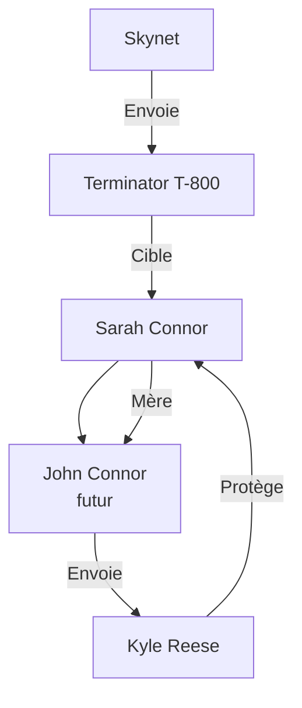

# Résumé de Terminator 1️⃣

1. **Sarah Connor** : Jeune serveuse à Los Angeles, cible principale du Terminator.
2. **Kyle Reese** : Soldat envoyé du futur pour protéger Sarah. Il devient son amant et le père de **John Connor**.
3. **Le Terminator** (T-800) : Cyborg assassin envoyé du futur pour tuer **Sarah Connor**.
4. **John Connor** : Futur leader de la résistance humaine, fils de Sarah (pas encore né dans ce film).
5. **Skynet** : Intelligence artificielle du futur qui envoie le Terminator.

<!--
Ce diagramme illustre les relations entre les principaux personnages de **Terminator 1**. Ils montrent comment Sarah Connor est au centre de l'intrigue, étant à la fois la cible du Terminator et la future mère de John Connor. Kyle Reese est envoyé pour la protéger, tandis que le Terminator est envoyé par Skynet pour l'éliminer.
-->

> L'histoire tourne autour de la tentative du Terminator de tuer Sarah pour empêcher la naissance de John. Kyle Reese la protège, lui explique la situation future, et finit par se sacrifier pour la sauver. Sarah survit et se prépare à l'avenir, sachant qu'elle portera et élèvera le futur sauveur de l'humanité.

___
[◀️ Previous](./04-humans.md#ih--) | [Next: Objectifs ▶️](./06-goals.md#-objectifs-de-cette-présentation)