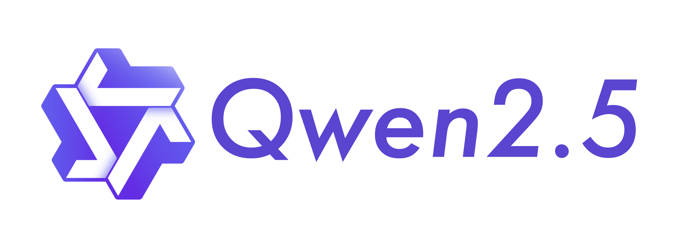

# `(Very)` Small Language Models / Tiny LLMs


## Chat completion avec Qwen 2.5



```
# Chat completion
qwen2.5:1.5b    986 MB
qwen2.5:0.5b    397 MB
```

- https://ollama.com/library/qwen2.5
- `b`: milliards de paramètres
- Plus il y a de paramètres, plus le modèle peut capturer des motifs complexes
- Plus il y a de paramètres, plus les besoins en ressources de calcul sont importants

## Embeddings avec MXBai

```
# Embeddings
mxbai-embed-large:latest    669 MB
all-minilm:22m               45 MB
```

- https://ollama.com/library/all-minilm
- https://ollama.com/library/mxbai-embed-large

___
[◀️ Previous](./06-goals.md#-objectifs-de-cette-présentation) | [Next: 🦙 Ollama ▶️](./08-ollama.md#ollama-)