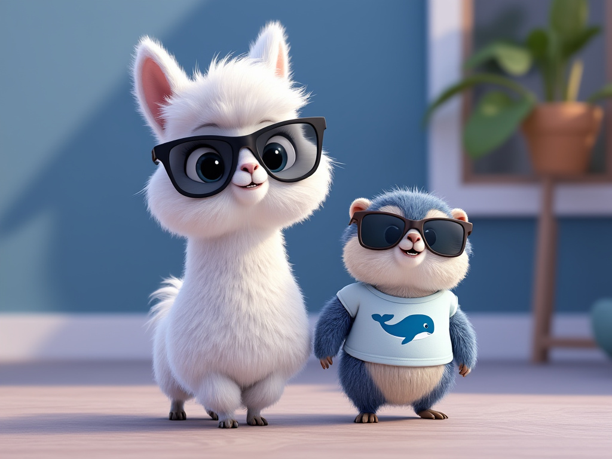

# Outils pour cette présentation

#### ⏺ J'🩵 la simplicité / 🦜⛓️ **LangChain*** "trop compliqué" (pour moi)
#### ⏺ Ollama SDK JavaScript et Python 👍
#### ⏺ Ollama est codé en Go 😍 (API)

___
[◀️ Previous](./08-ollama.md#ollama-) | [Next: La naissance ▶️](../01-birth/00-README.md#la-naissance-de-sarah-connor)

<!--
J'aime bien la simplicité. Dans mon apprentissage de l'IA Générative, j'ai trouvé les différents frameworks LangChain un peu compliqué.

Si vous souhaitez développer des applications "Gen AI" avec uniquement Ollama, je vous conseille d'utliser les SDK JavaScript et Python du projet, ils sont amplement suffisants pour la plupart des cas d'usage.

Pour cette présentation, je souhaitais utilise du Go, parce que sur des slides c'est un langage plutôt simple à lire. Mais je n'ai pas trouvé de SDK Go pour Ollama. J'ai donc décidé de créer pour cette présentation un SDK Go minimaliste, qui ne fait que ce que j'ai besoin pour cette présentation.
-->