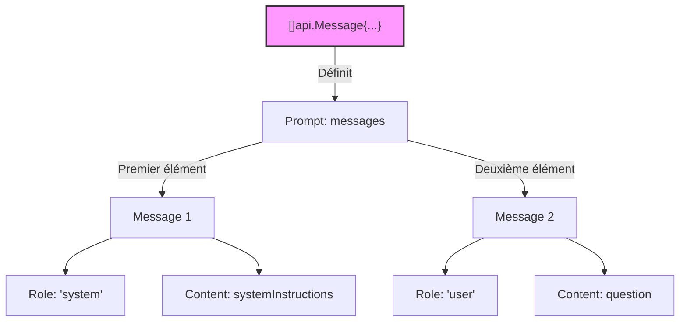

`[La naissance de Sarah Connor]`
## Principe du prompt



```golang
messages := []api.Message{
    {Role: "system", Content: systemInstructions},
    {Role: "user", Content: question},
}
```
___
[◀️ Previous](./README.md#la-naissance-de-sarah-connor) | [Next: Requête ▶️](./02-request.md#principe-de-la-requête)
