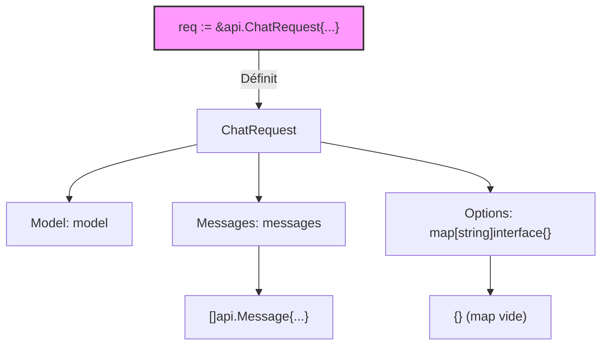

`[La naissance de Sarah Connor]`
## Principe de la requête

```mermaid
graph TD
    A[ChatRequest] --> B["Model: model"]
    A --> C["Messages: messages"]
    A --> D["Options: map[string]interface{}"]
    
    C --> E["[]api.Message{...}"]
    D --> F["{} (map vide)"]
    
    G["req := &api.ChatRequest{...}"]
    G -->|Définit| A
    
    style G fill:#f9f,stroke:#333,stroke-width:2px
```

___
[◀️ Previous](./01-prompt.md#principe-du-prompt) | [Next: Fonctionnement ▶️](./03-application.md#mode-de-fonctionnement)
