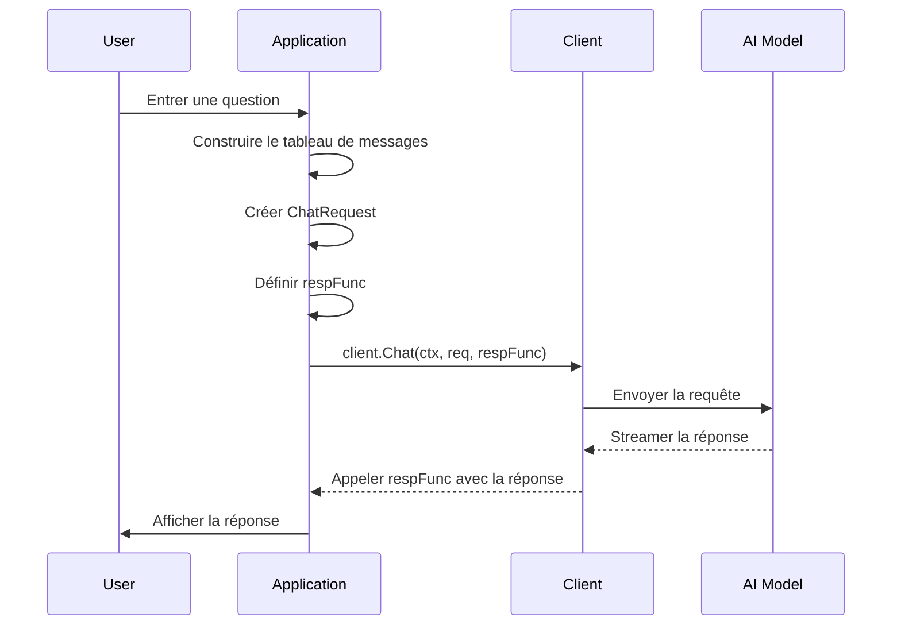

`[La naissance de Sarah Connor]`
## Mode de fonctionnement

```mermaid
sequenceDiagram
    participant U as User
    participant A as Application
    participant C as Client
    participant M as AI Model

    U->>A: Entrer une question
    A->>A: Construire le tableau de messages
    A->>A: Créer ChatRequest
    A->>A: Définir respFunc
    A->>C: client.Chat(ctx, req, respFunc)
    C->>M: Envoyer la requête
    M-->>C: Streamer la réponse
    C-->>A: Appeler respFunc avec la réponse
    A->>U: Afficher la réponse
```
___
[◀️ Previous](./02-request.md#principe-de-la-requête) | [Next: 👀 montre moi du code ▶️](./main.go#L15)

