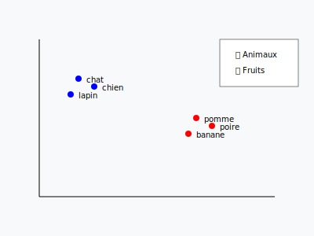

# Embedding ? 🤨

- Un embedding = transformer des données (ex: texte) en vecteurs de nombres. 
- Donner des "coordonnées" à des données pour les placer dans un espace mathématique où :
  - Les éléments **similaires** sont **proches**
  - Les éléments **différents** sont **éloignés**

## Utilité:

**Recherche sémantique**
   - Trouver des documents similaires 🖐️ ➡️ **`RAG`**
   - Rechercher des images ressemblantes 
   - Recommander des produits proches

___
[◀️ Previous](./00-README.md#rag-retrieval-augmented-generation) | [🤔 RAG⁉️ ▶️](./02-rag.drawio)