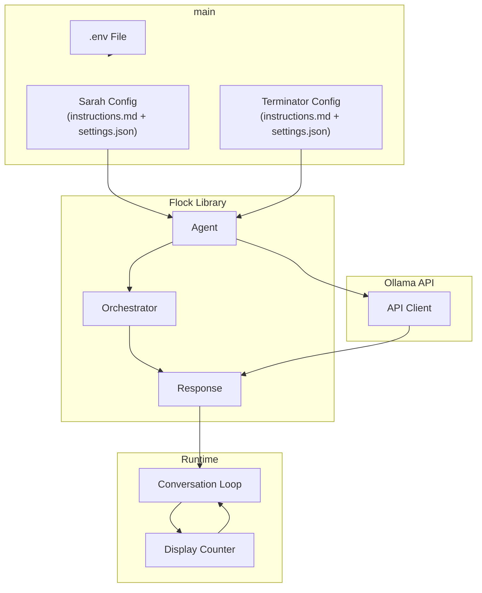
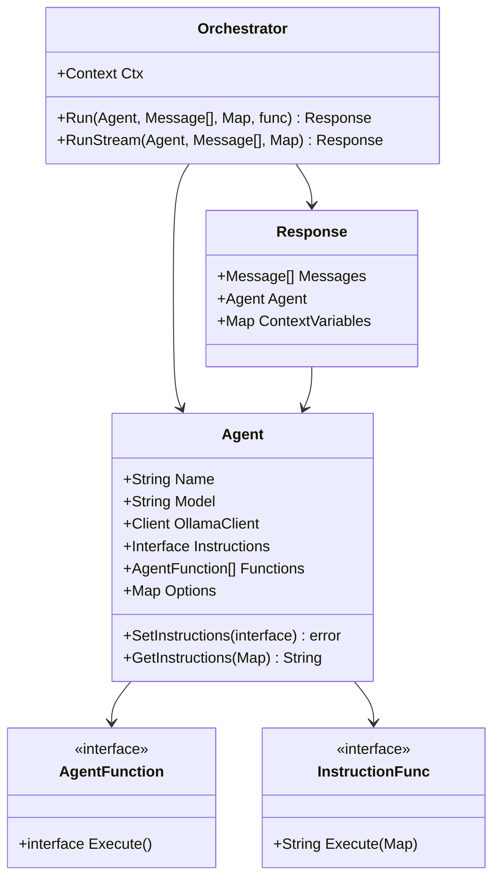

# One more thing: les Agents

### Sarah et le Terminator partent en week-end

#### Petite expérimentation inspirée par Swarm d'OpenAI

Le code se compose de deux parties principales :

1. `flock`: Une bibliothèque qui définit:
- Un `Agent` qui représente une IA avec un nom, un modèle, des instructions et des options
- Un `Orchestrator` qui gère l'exécution des agents et leurs conversations
- Des fonctionnalités pour gérer les instructions et les réponses

2. `main`: Un programme qui utilise `flock` pour:
- Créer deux agents: **Sarah** et un Terminator (**Model 101**)
- Configurer chaque agent avec ses propres **instructions** et modèle LLM
- Orchestrer une conversation entre eux dans un café
- Afficher la conversation avec un compteur de temps pour chaque réponse

Points clés du fonctionnement :

1. Configuration:
- Les agents sont configurés via des fichiers (.env, instructions.md, settings.json)
- Chaque agent a son propre modèle LLM et ses propres instructions

2. Conversation:
- Se déroule en tours alternés entre Sarah et Terminator
- Chaque message est ajouté à l'historique de la conversation
- Un compteur visuel (⏳) indique le temps de réflexion

3. Communication:
- Utilise l'API Ollama pour communiquer avec les modèles LLM
- Les réponses sont streamées (affichées progressivement)
- Les messages sont formatés avec des couleurs différentes pour chaque agent

**Le système est conçu de manière modulaire, ce qui permet de créer facilement différents types d'agents avec différentes personnalités et instructions.**

