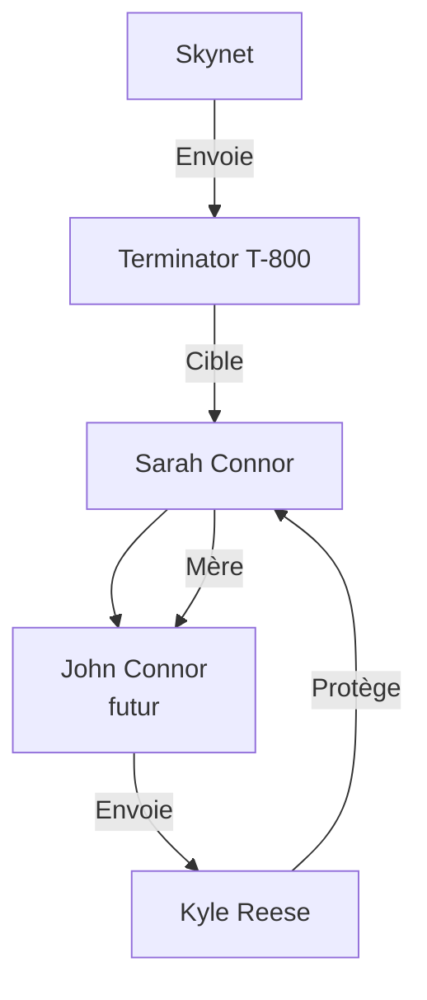

Ce diagramme illustre les relations entre les principaux personnages de **Terminator 1**. Ils montrent comment Sarah Connor est au centre de l'intrigue, étant à la fois la cible du Terminator et la future mère de John Connor. Kyle Reese est envoyé pour la protéger, tandis que le Terminator est envoyé par Skynet pour l'éliminer.

